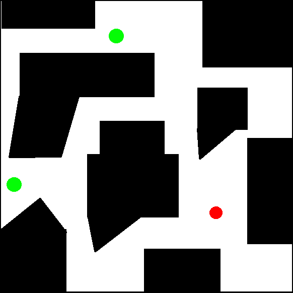
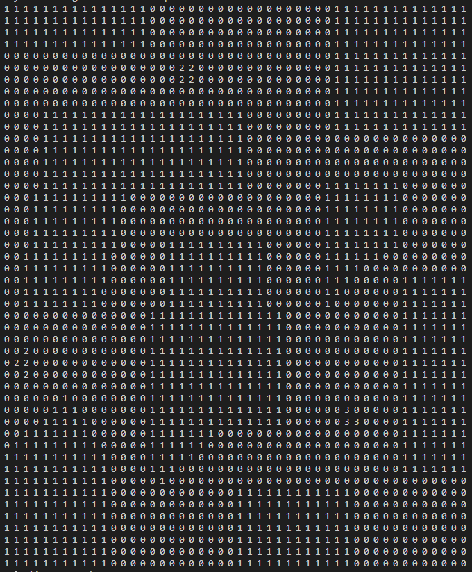
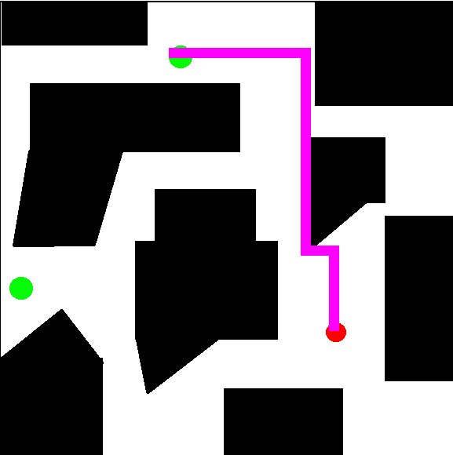

# LABORATORIO 5 - Inteligencia Artificial
## Resolución de Laberintos con Búsqueda en Anchura

* [Enlace al repositorio](https://github.com/FabianKel/LAB5-IA)

* [Enlace al video de demostración](https://youtu.be/8rNEJRqAU8Q)


## Integrantes del equipo
- [Mónica Salvatierra - 22249](https://github.com/alee2602)
- [Paula Barillas - 22764](https://github.com/paulabaal12)
- [Derek Arreaga - 22537](https://github.com/FabianKel) 

## Descripción

Este laboratorio implementa un algoritmo de búsqueda en anchura (BFS) para resolver laberintos representados como imágenes. El programa convierte la imagen en una representación discreta, resuelve el laberinto y visualiza la solución.

## Requisitos

Antes de ejecutar el programa, asegúrate de tener instaladas las siguientes dependencias:

```bash
pip install opencv-python numpy
```

## Ejecución
Para ejecutar el programa, utiliza el siguiente comando en la terminal:
```bash
python main.py
```
Luego, se solicitará ingresar número de la imagen del laberinto.
El programa leerá la imagen, la discretizará, resolverá el laberinto utilizando BFS y mostrará la solución gráficamente.

## Funcionamiento
1. Se carga la imagen del laberinto y se discretiza en una matriz de celdas.

    | Input | Output |
    |----------|----------|
    |     |  |

2. Se define el problema del laberinto con un estado inicial y un estado objetivo.
3. Se ejecuta la búsqueda en anchura (BFS) para encontrar el camino desde el inicio hasta la meta.
4. Se reconstruye el camino de la solución y se muestra paso a paso.
    ```bash
        Solución encontrada:
        Paso 1: (34, 35) - Inicio
        Paso 2: (33, 35) - Moverse arriba
        Paso 3: (32, 35) - Moverse arriba
        Paso 4: (31, 35) - Moverse arriba
        Paso 5: (30, 35) - Moverse arriba
        Paso 6: (29, 35) - Moverse arriba
        Paso 7: (28, 35) - Moverse arriba
        Paso 8: (27, 35) - Moverse arriba
        Paso 9: (26, 35) - Moverse arriba
        Paso 10: (26, 34) - Moverse izquierda
        Paso 11: (26, 33) - Moverse izquierda
        Paso 12: (26, 32) - Moverse izquierda
        Paso 12: (26, 32) - Moverse izquierda
        Paso 13: (25, 32) - Moverse arriba
        Paso 14: (24, 32) - Moverse arriba
        Paso 12: (26, 32) - Moverse izquierda
        ..., etc.
    ```
    

5. Se visualiza el laberinto con la solución marcada en color.
<center>



</center>

### Elección de heurísticas

Las dos heurísticas empleadas para realizar el Graph-Search fueron:

1. **Heurística de Manhattan (A-star):** La heurística de Manhattan es adecuada en entornos donde el movimiento está restringido a desplazamientos en líneas rectas, es decir, únicamente en direcciones horizontales y verticales dentro de una cuadrícula. Su cálculo se basa en la suma de las distancias absolutas entre las coordenadas de origen y destino, lo que proporciona una estimación eficiente y sin sobreestimar la distancia real al objetivo. Esta característica la hace ideal para hallar caminos con con estructuras regulares, ya que permite que el algoritmo A* tome decisiones bien fundamentadas sin desviarse hacia caminos innecesarios.

2. **Heuristica Eucladiana (A-star):**  Es una opción apropiada en escenarios donde el movimiento no está restringido a ejes ortogonales y es posible desplazarse en cualquier dirección, incluyendo diagonales. Su cálculo se basa en la distancia en línea recta entre dos puntos, lo que ofrece una estimación más precisa en entornos con mayor libertad de movimiento. Aunque podría no ser tan eficiente como la heurística de Manhattan, en aquellos donde los desplazamientos diagonales están permitidos, proporciona una mejor aproximación de la distancia real y contribuye a una exploración más informada del espacio de búsqueda.

### Ejecución del laberinto  [turing.bmp](/turing.bmp):

Para la ejecución de este laberinto es necesario disminuír el tamaño de las celdas, es decir disminunir el tamaño los pasos para evitar saltos en los bordes. Para ello se puede cambiar la línea 84 del archivo [main.py](/main.py) de la siguiente manera:

*Antes*: 
```python
    cell_size = 12
```

*Después*: 
```python
    cell_size = 1
```


